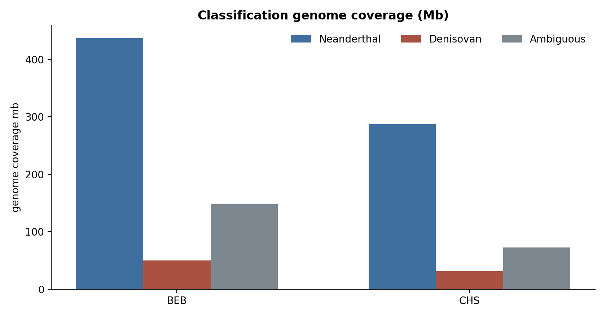
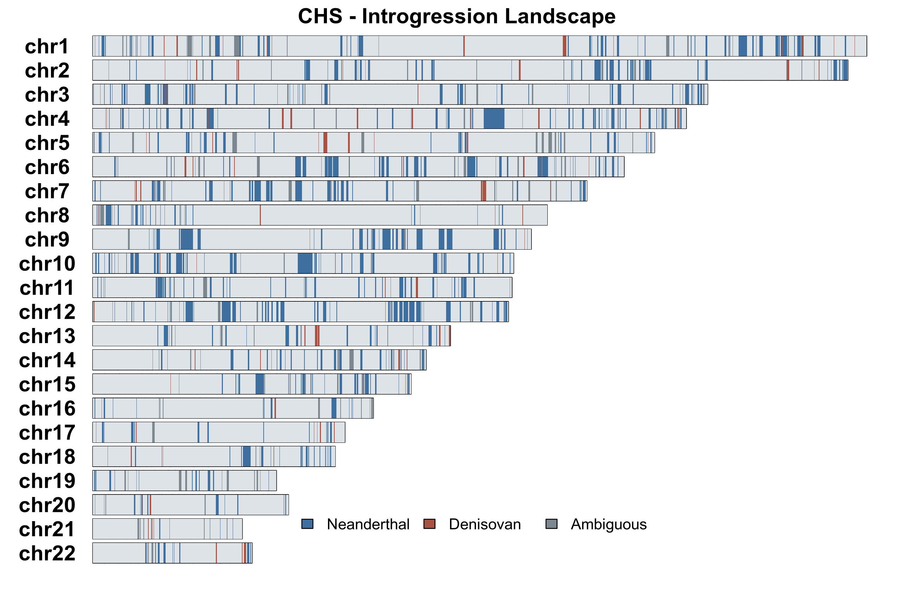
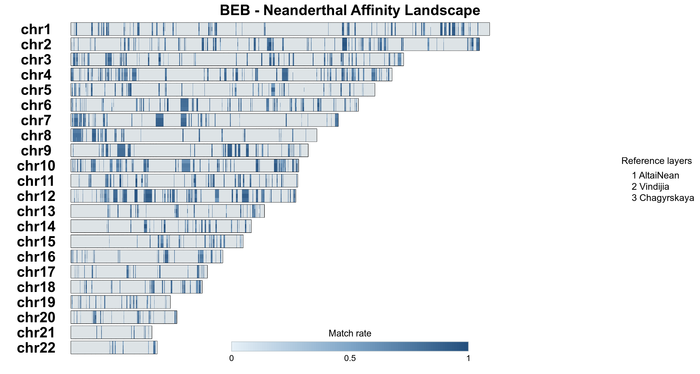
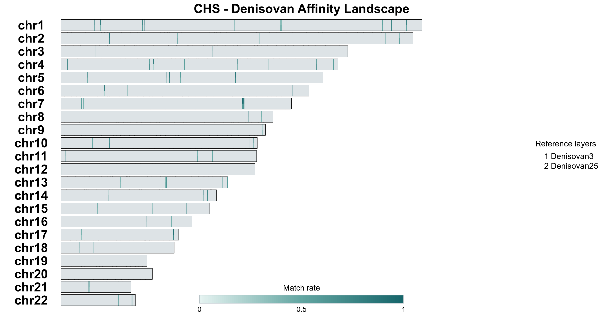
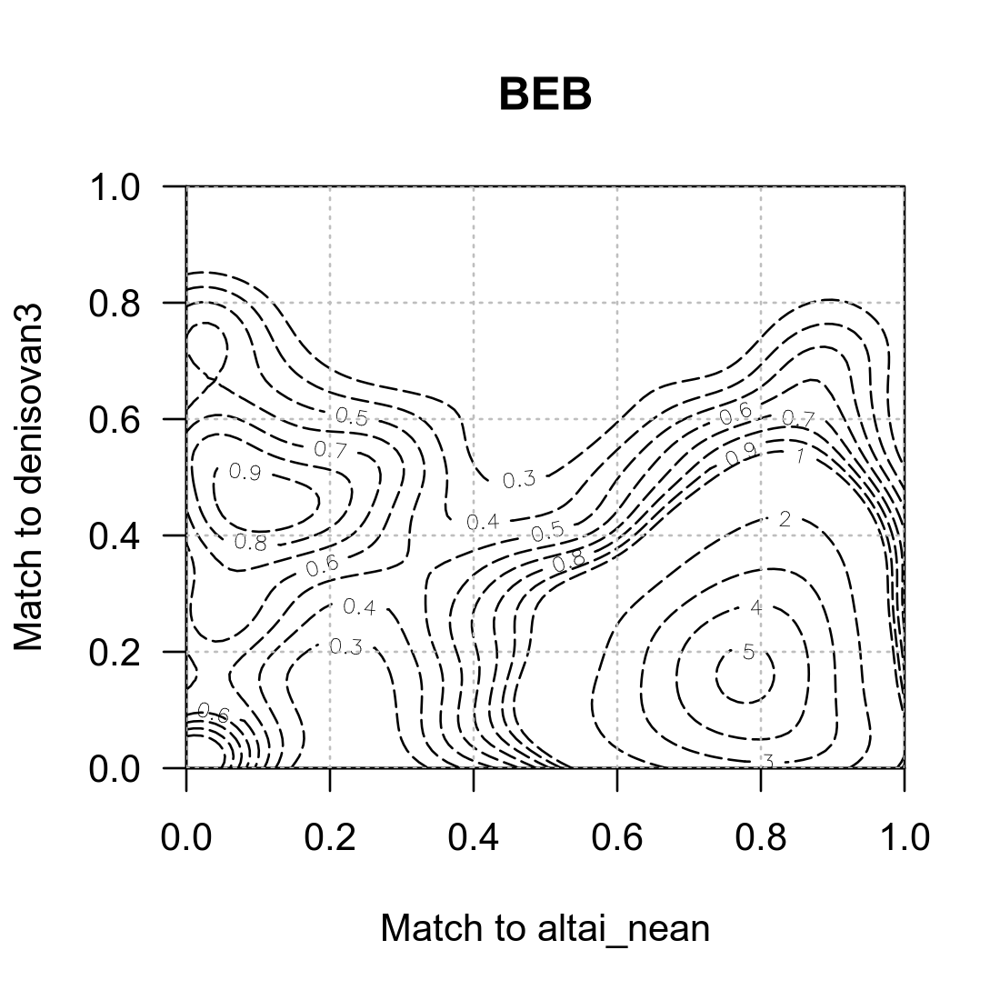
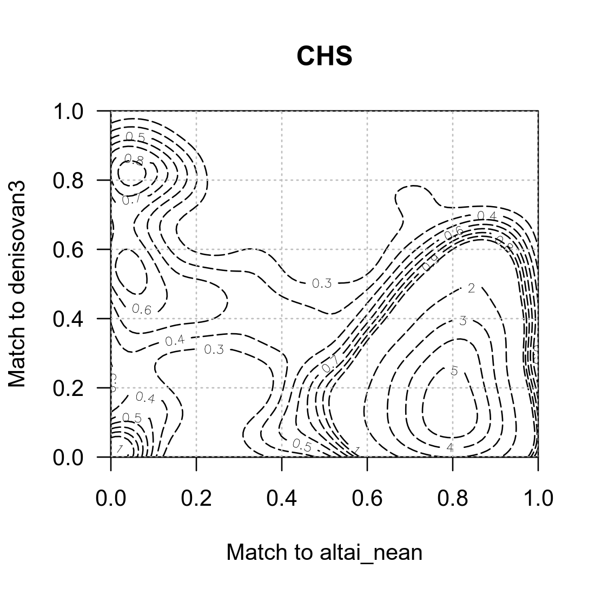
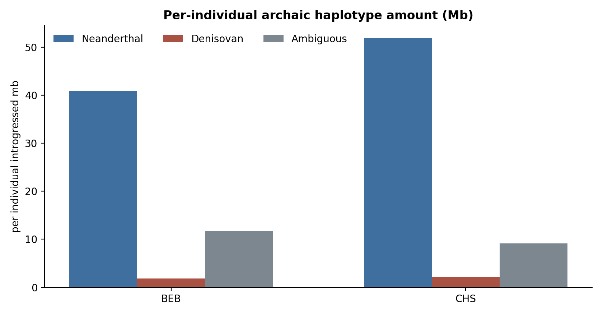
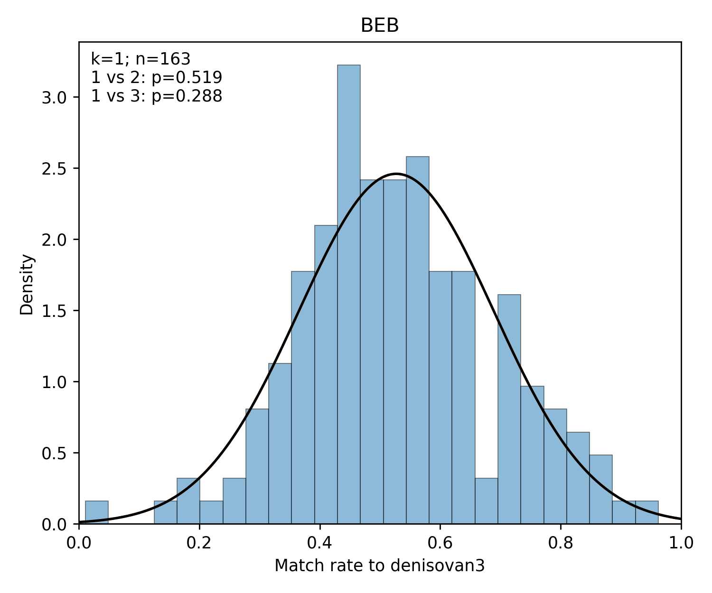
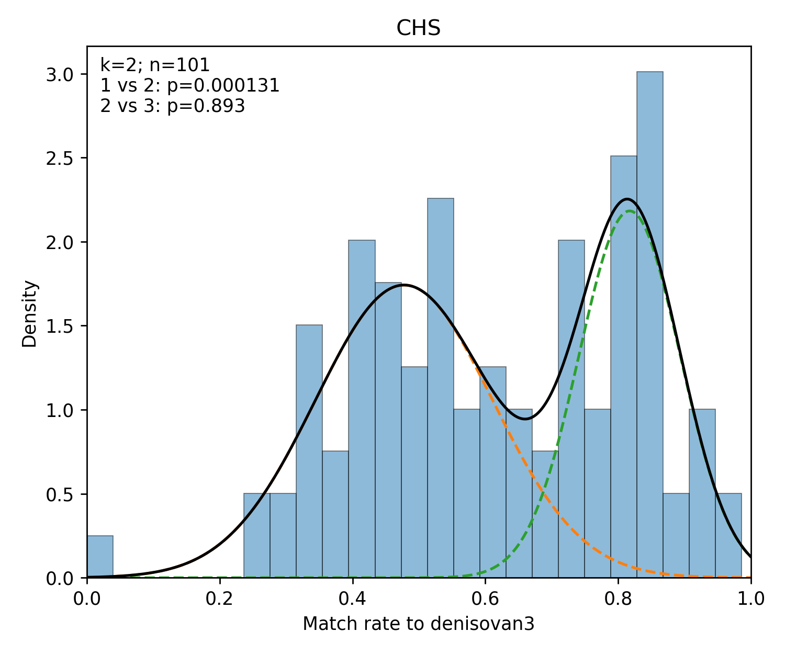

# Archaic Introgression Analysis Workflow

A reproducible workflow for multi-population archaic introgression analysis. It uses SPrime to identify archaic introgressed segments and integrates segment classification, haplotype/individual-level tract calling, GMM-based analysis of Denisovan introgression components, adaptive introgression screening, visualization, and automated reporting.

## Overview

The workflow supports:

- population-specific SPrime analysis;
- multiple target populations in a single run;
- support for an arbitrary number of Neanderthal and Denisovan reference individuals;
- segment-level archaic match statistics;
- Neanderthal / Denisovan / ambiguous classification;
- Denisovan introgressed component test based on match-rate distributions using GMM;
- haplotype(individual)-level introgressed tract calling;
- genome-wide introgression landscapes plots;
- reference-specific affinity landscapes plots;
- pairwise archaic affinity contour plots;
- adaptive introgression candidate screening;
- cross-population comparison of adaptive candidates;
- HTML and PDF reports;
- resumable execution.

---

## Installation

The workflow is designed for Linux.

Create the Conda environment:

```bash
conda env create -f environment.yaml
conda activate sprime-workflow
```

Compile `map_arch`:

```bash
cd tools/map_arch
make -B
cd ../..
```

Optional: run the test suite.

```bash
python -m unittest discover -s tests -v
```

---

## Running the workflow

Run the complete workflow:

```bash
python run.py run \
  --config config/config.yaml \
  --cores 8 \
  --memory-mb 32000
```

Input and output paths can also be overridden from the command line:

```bash
python run.py run \
  --config config/config.yaml \
  --vcf '/data/modern/chr{chrom}.vcf.gz' \
  --samples /data/metadata/samples.tsv \
  --outdir results/example \
  --cores 16 \
  --memory-mb 64000
```

Use `--dry-run` to inspect the planned jobs before execution:

```bash
python run.py run \
  --config config/config.yaml \
  --cores 8 \
  --memory-mb 32000 \
  --dry-run
```

Runs are resumable. If execution is interrupted, rerunning the same command will reuse completed outputs whose dependencies remain valid.

Convenience targets are also available:

```bash
--target matches
--target gmm
--target individual
```

---

## Input data

The workflow requires:

1. a phased modern-human VCF;
2. a sample metadata table;
3. a GRCh37 genetic map;
4. SPrime and `map_arch`;
5. one VCF and callable mask for each archaic reference.

The modern VCF may be either a single multi-chromosome file or a chromosome template.

### Sample metadata

The sample table is a tab-separated file with three columns:

```text
sample_id    population    role
```

`role` must be either `target` or `outgroup`.

Example:

```tsv
sample_id	population	role
BEB001	BEB	target
BEB002	BEB	target
CHS001	CHS	target
CHS002	CHS	target
YRI001	YRI	outgroup
YRI002	YRI	outgroup
```

Multiple target populations can be included in the same run. Each target population is analyzed independently, while outgroup samples are shared across population-specific SPrime analyses.

See `config/samples.tsv` for an example.

---

## Configuration

A complete analysis is controlled through `config/config.yaml`.

### General parameters

| Parameter | Description |
|---|---|
| `genome_build` | Genome assembly used by the workflow. Landscape plotting currently assumes GRCh37/hg19. |
| `vcf` | Modern phased VCF; may be a single file or a `{chrom}` template. |
| `samples` | Sample metadata TSV containing `sample_id`, `population`, and `role`. |
| `outdir` | Output directory. |
| `chromosomes` | Chromosomes included in the analysis. |
| `genetic_map` | Genetic map supplied to SPrime. |
| `sprime_minscore` | Minimum candidate score passed to SPrime. |
| `summary_min_callable` | Minimum number of callable archaic sites required to report a segment-level match rate. |

---

## Archaic references

Any number of archaic references can be configured.

| Field | Description |
|---|---|
| `id` | Internal identifier used in output paths and table columns. |
| `group` | Archaic group: `neanderthal` or `denisovan`. |
| `tag` | Human-readable reference label. |
| `vcf` | Per-chromosome archaic VCF. |
| `mask` | Callable-region mask for the archaic reference. |

Each reference is matched independently against the same SPrime candidate markers, so reference-specific counts and match rates are retained.

---

## Archaic classification

Classification uses the maximum available match rate within the configured Neanderthal and Denisovan reference groups.

For each segment:

```text
max_N = maximum available Neanderthal match rate
max_D = maximum available Denisovan match rate
```

A segment is classified as **Neanderthal** when:

```text
max_N > neanderthal_gt
max_D < denisovan_lt_for_neanderthal
```

Default:

```text
max_N > 0.60
max_D < 0.40
```

A segment is classified as **Denisovan** when:

```text
max_D > denisovan_gt
max_N < neanderthal_lt_for_denisovan
```

Default:

```text
max_D > 0.30
max_N < 0.30
```

---

# Gaussian mixture modeling

GMM analysis evaluates the distribution of archaic match rates after a dedicated eligibility filter.


## GMM input filtering

GMM statistics are recalculated after retaining SPrime markers satisfying:

```text
SCORE > score_gt
```

A reference participates in eligibility filtering only when:

```text
callable >= min_callable
```

Candidate segments are retained when:

```text
max(qualified Neanderthal rate) < neanderthal_rate_lt
max(qualified Denisovan rate) > denisovan_rate_gt
```

Each `target_reference` must additionally satisfy its own callable requirement. GMMs are fitted independently for every:`population` × `target_reference`

One-, two-, and three-component Gaussian mixture models are fitted. Available methods are:`legacy_chi_square` and `parametric_bootstrap`

`AIC` and `BIC` are retained as diagnostics but do not determine the selected component count.

Mixture components describe statistical structure in the match-rate distribution and should not by themselves be interpreted as direct evidence for a specific number of historical introgression events.


---

## Individual-level introgression

Individual-level analysis examines candidate introgressed markers separately for each phased haplotype.

```yaml
individual:
  enabled: true
  min_markers: 2
```

---

## Genome-wide landscapes
Displays the genomic distribution of `Neanderthal`/`Denisovan`/`ambiguous` segments. One landscape is generated for each target population.

```yaml
landscape:
  enabled: true
```
Displays reference-specific match rates along the genome. Separate figures are generated for Neanderthal- and Denisovan-classified segments for each population.

```yaml
affinity:
  enabled: true
```

---

## Pairwise archaic affinity contours

Contour plots compare segment-level match rates between pairs of archaic references. Two modes are supported:`all_pairs` and `explicit_pairs`

```yaml
plots:
  contour:
    enabled: true
    mode: all_pairs
    pairs: []
```

```yaml
plots:
  contour:
    enabled: true
    mode: explicit_pairs
    pairs:
      - [altai_nean, denisovan3]
```

The report can display one selected pair across all target populations:

```yaml
report:
  enabled: true
  contour_pair: [altai_nean, denisovan3]
```

---

## Adaptive introgression screening

Adaptive screening uses the inferred introgressed-allele frequency at SPrime markers.

```yaml
adaptive:
  enabled: true
  min_allele_frequency: 0.30
  max_frequency_drop: 0.20
  min_callable_sites: 10
  neanderthal_match_threshold: 0.50
  denisovan_match_threshold: 0.40
```

Initial candidate markers must satisfy:

```text
introgressed_AF > min_allele_frequency
```

Core variants are then defined as:

```text
introgressed_AF >= max_AF - max_frequency_drop
```

Archaic match rates are recalculated using these core variants.

A Neanderthal-associated candidate passes when at least one configured Neanderthal reference satisfies:

```text
callable >= min_callable_sites
AND
match_rate >= neanderthal_match_threshold
```

Denisovan-associated candidates are evaluated analogously using `denisovan_match_threshold`.

Candidates are ranked independently within each population and archaic group using `core_mean_AF`.

The workflow reports the Top2 candidates per population and group and identifies overlapping Top2 regions across populations.

---

## Output structure

A complete run produces:

```text
results/run001/
├── qc/
│   └── validation.tsv
├── sprime/
│   └── {population}/chr{chrom}.score
├── archaic_match/
│   └── {population}/{reference}/chr{chrom}.mscore
├── tables/
│   ├── segment_match_rates.wide.tsv.gz
│   ├── segment_match_rates.long.tsv.gz
│   ├── population_match_summary.tsv
│   └── classification_summary.tsv
├── classification/
│   └── {population}.tsv
├── gmm/
│   ├── model_selection.tsv
│   ├── components.tsv
│   └── plots/
├── individual_calls/
│   ├── all_individual_calls.tsv.gz
│   ├── individual_summary.tsv
│   └── by_population/
├── affinity/
│   └── {population}/{reference}.tsv.gz
├── adaptive/
│   ├── variants.tsv.gz
│   ├── core_variants.tsv.gz
│   ├── segment_summary.tsv
│   ├── top2_candidates.tsv
│   └── shared_top2_regions.tsv
├── plots/
│   ├── landscape/
│   └── contour/
├── provenance/
│   ├── run_manifest.json
│   ├── resolved_config.json
│   ├── software_versions.tsv
│   ├── input_manifest.tsv
│   └── output_manifest.tsv
├── report/
│   ├── report.html
│   ├── report.pdf
│   ├── classification_summary.png
│   └── individual_summary.png
├── logs/
└── work/
```

---

## Final report

When enabled:

```yaml
report:
  enabled: true
```

the workflow generates:

```text
report/report.html
report/report.pdf
```

The report summarizes:

- analysis settings;
- archaic classification;
- multi-population genome coverage;
- introgression landscapes;
- archaic affinity landscapes;
- pairwise contour plots;
- individual-level introgression;
- GMM model results;
- adaptive introgression candidates;
- software versions.

---

## Example multi-population analysis

The workflow was tested in a joint analysis of two 1000 Genomes populations, **BEB** and **CHS**. Selected outputs are shown below.

### Classification summary



### Introgression landscape



### Archaic affinity landscapes

**BEB — Neanderthal affinity**



**CHS — Denisovan affinity**



### Pairwise archaic affinity

| BEB | CHS |
|---|---|
|  |  |

### Individual-level summary



### Gaussian mixture models

GMMs are fitted independently for every configured population-reference combination. The report displays figures only for models selecting two or three components.

| BEB | CHS |
|---|---|
|  |  |

Complete model-selection results are available in:

```text
gmm/model_selection.tsv
```

---

## Citation

If you use SPrime, please cite:

> Browning SR, Browning BL, Zhou Y, Tucci S, Akey JM.  
> **Analysis of human sequence data reveals two pulses of archaic Denisovan admixture.**  
> *Cell*. 2018;173(1):53–61.  
> doi:10.1016/j.cell.2018.02.031